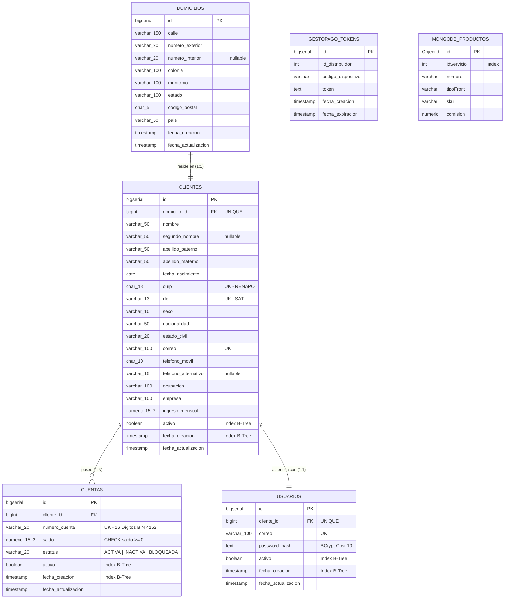

# 🏦 Proyecto Integrador: Onboarding de Clientes Personas Físicas

[](https://openjdk.org/)
[](https://spring.io/projects/spring-boot)
[](https://www.postgresql.org/)
[](https://www.mongodb.com/)
[](https://pruebagestopagos-csas.onrender.com/swagger-ui/index.html)

> 🚀 **Despliegue en Vivo en Render:**  
> **Swagger UI:** [https://pruebagestopagos-csas.onrender.com/swagger-ui/index.html](https://pruebagestopagos-csas.onrender.com/swagger-ui/index.html)

---

## 🎯 Matriz de Entregables Oficiales Solicitados

| # | Entregable Oficial Solicitado | Estado | Ubicación en el Repositorio / Documentación |
|---|---|:---:|---|
| **1** | **Diagrama entidad-relación** | ✅ Completo | Ver [Sección ERD](#️-modelo-entidad-relación-erd-realista-en-mermaid) y archivo técnico [`DISENO_BASE_DE_DATOS.md`](file:///c:/Users/SAMAEL/Downloads/prueba/prueba/docs/bd/DISENO_BASE_DE_DATOS.md). |
| **2** | **Script de creación de base de datos** | ✅ Completo | Script DDL independiente [`schema_completo.sql`](file:///c:/Users/SAMAEL/Downloads/prueba/prueba/schema_completo.sql) y migración Flyway [`V3__onboarding_clientes.sql`](file:///c:/Users/SAMAEL/Downloads/prueba/prueba/src/main/resources/db/migration/V3__onboarding_clientes.sql). |
| **3** | **Código fuente completo** | ✅ Completo | Proyecto Spring Boot 3.3.6 / Java 21 estructurado en [`src/main/java/com/proyecto/servicios`](file:///c:/Users/SAMAEL/Downloads/prueba/prueba/src/main/java/com/proyecto/servicios). |
| **4** | **API REST funcional** | ✅ Completo | 22 endpoints en producción: [Swagger UI en Vivo (Render)](https://pruebagestopagos-csas.onrender.com/swagger-ui/index.html) y local en `http://localhost:8081/swagger-ui.html`. |
| **5** | **Evidencias de pruebas realizadas** | ✅ Completo | 5 suites de pruebas unitarias automatizadas y guía detallada en [`PLAN_DE_PRUEBAS_Y_EXPLICACION.md`](file:///c:/Users/SAMAEL/Downloads/prueba/prueba/docs/pruebas/PLAN_DE_PRUEBAS_Y_EXPLICACION.md). |
| **6** | **Documento técnico explicando la solución** | ✅ Completo | Índice temático desglosado a continuación y en el [`README.md` principal](file:///c:/Users/SAMAEL/Downloads/prueba/prueba/README.md). |

---

## 📚 Índice de Documentación Técnica

La documentación detallada se encuentra modularizada en las siguientes guías técnicas:

1. 🗄️ [**Diseño de Base de Datos y Modelo Físico**](file:///c:/Users/SAMAEL/Downloads/prueba/prueba/docs/bd/DISENO_BASE_DE_DATOS.md)
   * Modelo físico en PostgreSQL y migración Flyway `V3`.
   * Justificación técnica de tipos de datos (`NUMERIC(15,2)`, `CHAR(18)`, `CHAR(10)`).
   * Estrategia de 14 índices B-Tree para consultas masivas de **100,000+ registros**.
2. 🛡️ [**Reglas de Negocio y Validaciones**](file:///c:/Users/SAMAEL/Downloads/prueba/prueba/docs/validaciones/REGLAS_Y_VALIDACIONES.md)
   * Expresiones regulares oficiales de CURP y RFC mexicanos.
   * Validación estricta de mayoría de edad ($\ge 18$ años cumplidos).
   * Matriz de excepciones HTTP (`400`, `401`, `404`, `409`, `422`).
3. 🚀 [**Flujo Transaccional de Onboarding**](file:///c:/Users/SAMAEL/Downloads/prueba/prueba/docs/onboarding/REGISTRO_Y_ONBOARDING.md)
   * Orquestación atómica con `@Transactional`: Domicilio ➔ Cliente ➔ Cuenta Bancaria ➔ Usuario BCrypt.
   * Algoritmo de generación de cuenta bancaria anticolisión con prefijo BIN `4152...`.
4. 📊 [**Consultas, Paginación y Operaciones CRUD**](file:///c:/Users/SAMAEL/Downloads/prueba/prueba/docs/crud/CONSULTAS_Y_OPERACIONES.md)
   * Paginación obligatoria `Pageable` con `@ParameterObject` para Swagger.
   * Inmutabilidad estricta de CURP, RFC y número de cuenta.
   * Baja lógica en cascada (desactivación simultánea de cliente, cuentas y usuario).
5. 🔐 [**Seguridad, Autenticación y Cabeceras**](file:///c:/Users/SAMAEL/Downloads/prueba/prueba/docs/seguridad/AUTENTICACION_Y_HEADERS.md)
   * Cabecera `Authorization: Bearer <TOKEN>` documental no bloqueante en Swagger.
   * Hashing de contraseñas con BCrypt (factor de costo 10).
   * Generación y validación de tokens JWT estándar (HMAC-SHA256).
6. 🧪 [**Plan de Pruebas en Swagger y Explicación desde Cero**](file:///c:/Users/SAMAEL/Downloads/prueba/prueba/docs/pruebas/PLAN_DE_PRUEBAS_Y_EXPLICACION.md)
   * Explicación pedagógica de la arquitectura y flujo de la aplicación.
   * Guía cronológica paso a paso para probar los 22 endpoints en Swagger.

---

## 🗄️ Modelo Entidad-Relación (ERD) Realista en Mermaid



---

## 🧪 Evidencias de Pruebas

### Resumen de Suites Unitarias (100% Exitosas)
```text
> Task :test
BUILD SUCCESSFUL in 32s
5 actionable tasks: 3 executed, 2 up-to-date
```
- `ClienteServiceImplTest`: 8/8 pruebas aprobadas (Onboarding atómico, mayoría de edad, unicidad, inmutabilidad y cascada).
- `CuentaServiceImplTest`: 5/5 pruebas aprobadas (Apertura adicional, saldo, bloqueo).
- `AuthServiceImplTest`: 4/4 pruebas aprobadas (Login JWT, validación de contraseñas BCrypt).
- `CatalogoProductoServiceImplTest`: Pruebas de integración Feign y MongoDB.
- `JaxbXmlParserTest`: Deserialización XML JAXB.

### Casos de Prueba REST Ejecutados:
- **`POST /clientes` ➔ `201 Created`:** Onboarding exitoso con generación de tarjeta `4152...` y credenciales.
- **`POST /clientes` ➔ `422 Unprocessable Entity`:** Rechazo inmediato por minoría de edad (< 18 años).
- **`POST /clientes` ➔ `409 Conflict`:** Rechazo por duplicidad de CURP o RFC.
- **`POST /auth/login` ➔ `200 OK`:** Validación de credenciales y emisión de Bearer Token JWT.
- **`POST /auth/login` ➔ `401 Unauthorized`:** Rechazo por contraseña incorrecta o usuario inactivo.
- **`GET /cuentas/{numero}/saldo` ➔ `200 OK`:** Consulta rápida de saldo contable.
- **`PATCH /clientes/{id}` ➔ `200 OK`:** Actualización de datos garantizando inmutabilidad de CURP y RFC.
- **`DELETE /clientes/{id}` ➔ `204 No Content`:** Baja lógica en cascada (inactiva cliente, cuentas y usuario).
- **`GET /api/v1/catalogo/productos` ➔ `200 OK`:** Consulta de catálogo NoSQL conectado a MongoDB Atlas.
