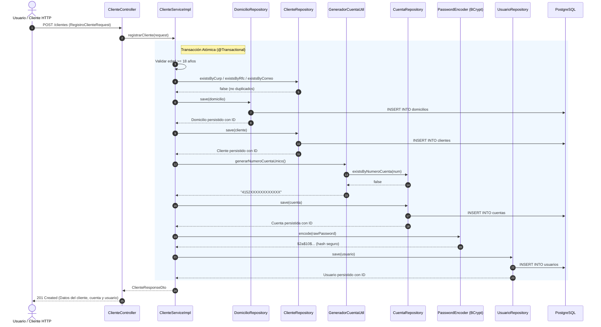

# Flujo de Onboarding de Clientes Personas Físicas

Este documento describe la arquitectura, reglas de negocio y diseño técnico del proceso integral de **Onboarding** (Alta de Cliente, Creación de Cuenta Bancaria y Generación de Credenciales de Usuario) implementado en [ClienteServiceImpl](file:///c:/Users/SAMAEL/Downloads/prueba/prueba/src/main/java/com/proyecto/servicios/service/Impl/ClienteServiceImpl.java).

---

## 1. Objetivo y Reglas de Negocio del Onboarding

El onboarding es un proceso atómico en el cual un cliente persona física es dado de alta en la institución financiera. Para que el registro sea exitoso, deben cumplirse rigurosamente las siguientes directivas:

1. **Mayoría de Edad Obligatoria:**
   - La edad mínima permitida es de **18 años cumplidos** a la fecha actual.
   - Se calcula con `java.time.Period.between(fechaNacimiento, LocalDate.now()).getYears()`. Si es menor de 18, se interrumpe con `ValidacionNegocioException` (HTTP 422).
2. **Validación de Unicidad Previa:**
   - No se permiten duplicados en **CURP**, **RFC** ni **Correo Electrónico**.
   - Se consulta la existencia mediante métodos indexados en base de datos (`existsByCurp`, `existsByRfc`, `existsByCorreo`).
3. **Generación Automática de Cuenta Bancaria:**
   - Se genera una cuenta de 16 dígitos con prefijo BIN bancario (`4152...`), garantizando que no colisione con cuentas existentes mediante verificación en `cuentaRepository.existsByNumeroCuenta`.
   - Se le asigna un saldo inicial (`BigDecimal`), estatus `ACTIVA` y `activo = true`.
4. **Generación de Credenciales de Acceso:**
   - Se crea el usuario de acceso con el correo del cliente.
   - La contraseña se procesa con **BCrypt** (`PasswordEncoder` con factor de coste 10) antes de persistirse.
5. **Atomicidad Transaccional (`@Transactional`):**
   - El alta de domicilio, cliente, cuenta y usuario se ejecuta en una sola transacción de base de datos. Si ocurre un fallo en cualquier punto (ej. error en hash, colisión o timeout), se realiza un **rollback completo**, evitando registros huérfanos.

---

## 2. Diagrama de Secuencia del Onboarding



---

## 3. Preparación para Carga Masiva (100,000+ Registros)

Para soportar las pruebas de estrés masivas solicitadas:

1. **Índices B-Tree Estratégicos:**
   - La tabla `clientes` cuenta con índices únicos sobre `curp`, `rfc`, `correo`, y la tabla `cuentas` sobre `numero_cuenta`. Esto permite que las consultas `existsBy...` se resuelvan en $O(\log N)$ en milisegundos.
2. **Generación Eficiente de Cuentas:**
   - El algoritmo utiliza `ThreadLocalRandom` con un espacio muestral de $10^{12}$ combinaciones para los últimos 12 dígitos de la tarjeta, minimizando virtualmente a cero las colisiones.
3. **Costo Equilibrado de BCrypt:**
   - Se configuró el factor de trabajo (work factor) en `10`. Un factor mayor (ej. 14 o 15) consumiría excesivos ciclos de CPU en ráfagas de 100k inserciones, mientras que un factor de 10 ofrece el equilibrio perfecto entre seguridad criptográfica contra fuerza bruta y rendimiento por segundo.

---

## 4. Estructura de Respuesta del Onboarding

```json
{
  "id": 1,
  "nombre": "Juan",
  "segundoNombre": "Carlos",
  "apellidoPaterno": "Pérez",
  "apellidoMaterno": "González",
  "fechaNacimiento": "1990-05-15",
  "curp": "PEGA900515HDFRNR09",
  "rfc": "PEGA9005151A2",
  "sexo": "M",
  "nacionalidad": "Mexicana",
  "estadoCivil": "SOLTERO",
  "correo": "juan.perez@example.com",
  "telefonoMovil": "5512345678",
  "telefonoAlternativo": null,
  "ocupacion": "Ingeniero",
  "empresa": "Tech Solutions",
  "ingresoMensual": 35000.00,
  "activo": true,
  "fechaCreacion": "2026-10-06T14:30:00",
  "domicilio": {
    "calle": "Av. Insurgentes Sur",
    "numeroExterior": "1602",
    "numeroInterior": "Piso 4",
    "colonia": "Crédito Constructor",
    "municipio": "Benito Juárez",
    "estado": "CDMX",
    "codigoPostal": "03940",
    "pais": "México"
  },
  "cuentas": [
    {
      "id": 1,
      "clienteId": 1,
      "numeroCuenta": "4152849102938475",
      "saldo": 1500.00,
      "estatus": "ACTIVA",
      "activo": true,
      "fechaCreacion": "2026-10-06T14:30:00"
    }
  ],
  "usuario": {
    "id": 1,
    "correo": "juan.perez@example.com",
    "activo": true,
    "fechaCreacion": "2026-10-06T14:30:00"
  }
}
```
